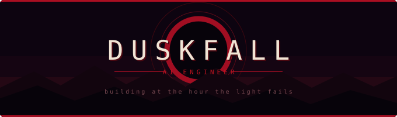

<div align="center">




<br/><br/>


</div>

<br/>

 **whoami**

```python
class Duskfall:
    def __init__(self):
        self.role     = "AI Engineer"
        self.stack    = ["Python", "PyTorch", "FastAPI", "React"]
        self.building = ["BioBerg", "Health-Nexus", "LAWkedIN"]
        self.learning = ["RAG pipelines", "model serving", "eval harnesses"]

    def philosophy(self):
        return "ship the ugly version, then earn the polish"
```

<br/>

 **arsenal**

<div align="center">


</div>

<br/>

 **telemetry**

<div align="center">


<br/>


<br/>


</div>

<br/>

 **selected work**

<div align="center">

<a href="https://github.com/shrxyas-246/BioBerg"></a>
<a href="https://github.com/shrxyas-246/Health-Nexus-"></a>
<a href="https://github.com/shrxyas-246/LAWkedIN"></a>
<a href="https://github.com/shrxyas-246/SwitchYard"></a>

</div>

<br/>

 **signal**

<div align="center">

<a href="https://linkedin.com/in/YOUR-HANDLE"></a>
<a href="mailto:YOUR-EMAIL"></a>
<a href="https://x.com/YOUR-HANDLE"></a>

<br/><br/>


</div>
